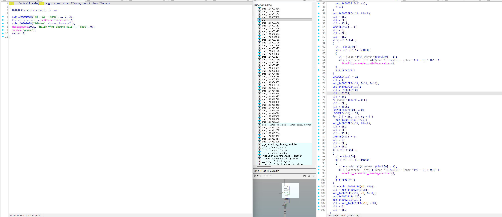

# call_obfuscate
## Function call confusion, using C++20
## Use

```
#include "call_obf.hpp"

void test(int a, int b)
{
	printf("%d + %d = %d\n", a, b, a + b);
}

REGISTER_FUNCTION(test)
REGISTER_FUNCTION(printf)

int main() 
{
	try {

		
		CALL(void(*)(int, int), test)(1, 2);
		
		CALL(int (*)(
			_In_z_ _Printf_format_string_ char const* const _Format,
			...), printf)("%d\r\n", CALL_IN_MODULE(int(*)(), kernel32.dll, GetCurrentProcessId)());


		CALL_IN_MODULE(int(*)(HWND, LPCSTR, LPCSTR, UINT), user32.dll, MessageBoxA)(nullptr, "Hello from secure call!", "Test", MB_OK);
		

	}
	catch (const std::exception& e)
	{
		std::cerr << "Error: " << e.what() << std::endl;
	}

	system("pause");
	return 0;
}
```
## Usage effect


